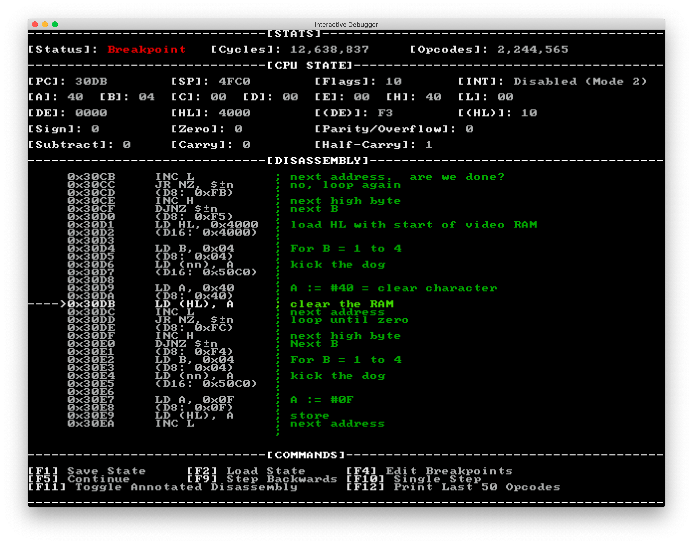

# Pac-Man Emulator


An emulator for the [Zilog Z80](https://en.wikipedia.org/wiki/Zilog_Z80) CPU and hardware specific to the 1980 arcade game: Pac-Man. It will also run Ms. Pac-Man, as well as any other homebrew ROMs that target the Pac-Man hardware.

This is based on the Intel 8080 CPU core from my [Space Invaders emulator](https://github.com/Justin-Credible/space-invaders-emulator).

It emulates the graphics and sound, supports save states, has an interactive debugger, has reverse-stepping functionality, and includes 8000+ unit test cases.


> Above: my emulator running Pac-Man, Ms. Pac-Man, and a homebrew [Matrix-effect ROM](http://umlautllama.com/projects/pacdocs/).

## Implementation

I wrote the emulator and disassembler in C# targeting the cross-platform [.NET Core](https://dotnet.microsoft.com/) runtime.

I used [SDL2](https://www.libsdl.org/) for the GUI and audio via the [SDL2#](https://github.com/flibitijibibo/SDL2-CS) wrapper.

The controls are hardcoded as:

* Insert Coin: `5` or `6`
* 1/2 Player Start: `1`/`2`
* Service Credit: `3`
* Rack Advance: `7`
* Test Switch: `8`
* Player 1 - Up/Down/Left/Right: arrow keys
* Player 2 - Up/Down/Left/Right: `W`/`S`/`A`/`D`
* Break/Debug: `BREAK` / `PAUSE` / `9`

## Compiling / Running

1. Install [.NET Core](https://dotnet.microsoft.com/download) 3.1
2. Install [SDL2](https://www.libsdl.org/download-2.0.php)
3. Clone this repository
4. `cd emulator`
5. `dotnet restore`
6. `dotnet run --` followed by the commands to pass to the CLI program

Currently there is only one command, `run`:

```
$ dotnet run -- run --help

Usage: pacemu run [arguments] [options]

Arguments:
  [ROM path]  The path to a directory containing the ROM set to load.

Options:
  -?|-h|--help          Show help information
  -rs|--rom-set         The name of an alternative ROM set and/or PCB configuration to use; pacman or mspacman; defaults to pacman
  -dw|--dip-switches    The path to a JSON file containing DIP switch settings; defaults to dip-switches.json in CWD.
  -l|--load-state       Loads an emulator save state from the given path.
  -sc|--skip-checksums  Allow running a ROM with invalid checksums.
  -wr|--writable-rom    Allow memory writes to the ROM address space.
  -d|--debug            Run in debug mode; enables internal statistics and logs useful when debugging.
  -b|--break            Used with debug, will break at the given address and allow single stepping opcode execution (e.g. --break 0x0248)
  -rs|--reverse-step    Used with debug, allows for single stepping in reverse to rewind opcode execution.
  -a|--annotations      Used with debug, a path to a text file containing memory address annotations for interactive debugging (line format: 0x1234 .... ; Annotation)
```

For example, to run Pac-Man: `dotnet run -- run ../roms/pacman`

Or, to run Ms. Pac-Man: `dotnet run -- run ../roms/mspacman --rom-set mspacman`

Game settings (such as number of lives and difficulty) can be adjusted by editing the [`dip-switches.json`](emulator/dip-switches.json) file.

Homebrew ROMs that target the Pac-Man hardware can be run by leaving the `--rom-set` set to the default `pacman` value. You may also need to use a few extra switches depending on the ROM. e.g. `dotnet run -- run ../roms/homebrew --skip-checksums --writable-rom`

## Interactive Debugger

If the emulator is launched with the `--debug` option, the debugger will be enabled. You can press the `pause`/`break` or `9` key which will stop execution and print the interactive debugger in the console.



From there you can use `F1` and `F2` to **save** and **load** the emulator **state**.

To **single step** over an opcode use `F10`, or `F5` to **continue** until the next breakpoint.

**Breakpoints** can be set via the `--break` option at startup, or in the debugger by pressing `F4`.

If the emulator was started with the `--annotations` option, `F11` can be used to toggle between the disassembler's generated psuedocode or the provided annotation file. This is used to **show comments for each disassembled opcode** inline in the debugger, which makes tracking down issues and/or understanding the game code easier. You can find an excellent annotated disassembly [here](https://github.com/BleuLlama/GameDocs/blob/master/disassemble/mspac.asm).

`F12` is used to print the last 30 opcodes, so you can see **execution history**.

Finally, if `--reverse-step` was specified at startup, `F9` can be used to single step _backwards_ over opcodes, effectively allowing you to **rewind CPU state one instruction at a time**. I found this to be very helpful when tracking down bugs in the CPU core.

## Unit Tests

While building the emulator I found it essential to write unit tests for each opcode and along the way. This made it much easier to track down bugs late in development.

Each opcode test contains Z80 assembly code which is assembled using [zasm](https://k1.spdns.de/Develop/Projects/zasm/Distributions/). This assembled binary is then executed on the emulated CPU and then has assertions ran against the CPU state to verify opcode behavior.

Additionally, there is an [integration test](z80.tests/Tests/CPUIntegrationTest.cs) which uses a CPU test program written for the Zilog Z80 CPU. This test program executes instructions and then performs checksums against memory that were taken from real hardware. The assembled program along with its disassembly can can be found in the [`z80.tests/ZEX`](z80.tests/ZEX) directory.

Zilog Z80 CPU tests (8000+ test cases):
1. `cd z80.tests`
2. `dotnet restore`
3. `dotnet test`

Finally, there are test cases for the Pac-Man specific hardware such as the video hardware which renders a screen of tiles and sprites in several different palettes and then compares them against the [reference images](emulator.tests/ReferenceData):


Emulator tests:
1. `cd emulator.tests`
2. `dotnet restore`
3. `dotnet test`

## Resources

I found the following resources useful in building this emulator:

* Zilog Z80 CPU
  * [O.G. Programming Manual](http://www.z80.info/zip/programming_the_z80_3rd_edition.pdf)
  * [Modern Programming Manual](http://www.zilog.com/force_download.php?filepath=YUhSMGNEb3ZMM2QzZHk1NmFXeHZaeTVqYjIwdlpHOWpjeTk2T0RBdlZVMHdNRGd3TG5Ca1pnPT0=)
  * [z80.info](https://www.z80.info)
  * [Z80 vs I8080 Differences](https://retrocomputing.stackexchange.com/a/1612)
  * [Opcode Table](http://clrhome.org/table)
  * [Opcode List](http://www.z80.info/z80oplist.txt)
  * [Flag Behavior](http://www.z80.info/z80href.txt)
  * [Instruction Set](http://z80-heaven.wikidot.com/instructions-set)
  * [The Amazing Zilog Z80](https://floooh.github.io/2016/06/15/the-amazing-z80.html), [Part 2](https://floooh.github.io/2016/07/12/z80-rust-ms1.html)
  * [Interrupts](https://z80journal.wordpress.com/2015/04/15/z80-interrupts/)
  * [Interrupts Documentation](http://www.z80.info/zip/z80-interrupts_rewritten.pdf)
* Z80 Instruction Exerciser
  * [Using Zexall/Zexdoc](http://jeffavery.ca/computers/macintosh_z80exerciser.html)
  * [Source 1](http://mdfs.net/Software/Z80/Exerciser/)
  * [Source 2](https://github.com/anotherlin/z80emu/tree/master/testfiles)
* Pac-Man Hardware
  * [Chris Lomont's Pac-Man Emulation Guide](https://www.lomont.org/software/games/pacman/PacmanEmulation.pdf)
  * [Color PROM Info](https://aarongiles.com/mamemem/part3.html)
  * [Hardware Details](https://simonowen.com/articles/pacemu/)
  * [Homebrew ROMs](http://umlautllama.com/projects/pacdocs/)
* Misc
  * [8-Bit Workshop](https://8bitworkshop.com/)
  * [Let there be sound](https://nicolasallemand.com/2019/12/12/let-there-be-sound/)
